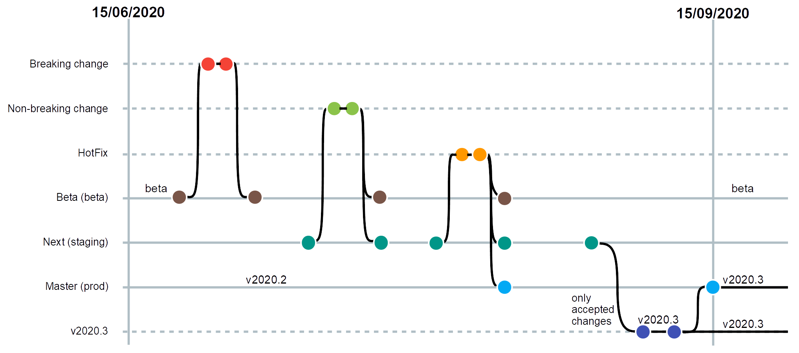
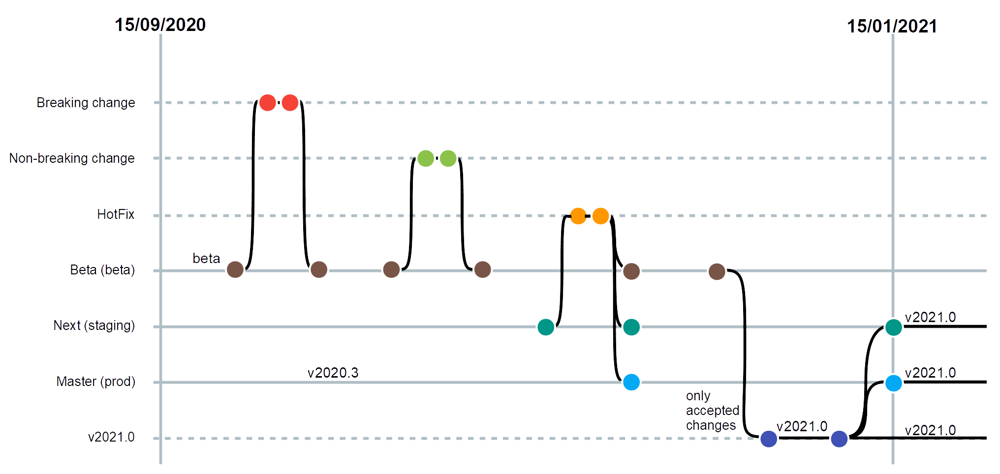

# Table of contents
- [Introduction](#introduction)
- [Objective and Summary](#objective-and-summary)
- [Overview](#overview)
  * [Current Situation](#current-situation)
  * [Desired Situation](#desired-situation)
- [Release Planning](#release-planning)
  * [Instances of the INSPIRE Reference Validator](#instances-of-the-inspire-reference-validator)
  * [Annual releases](#annual-releases)
    * [v2020.1 - 15/03/2020](#v20201---15-03-2020)
    * [v2020.2 - 15/06/2020](#v20202---15-06-2020)
    * [v2020.3 - 15/09/2020](#v20203---15-09-2020)
    * [v2021.0 - 15/01/2021](#v20210---15-01-2021)
- [Release Delivery](#release-delivery)

# Introduction

This document illustrates the release planning strategy for the INSPIRE Reference Validator, including all its components (ATS, ETS and ETF). The document explains the rationale behind the plan and details the foreseen release dates throughout the year together with their main expected changes. It also lists a number of resources for users to get informed on the future expected changes (future releases) in the INSPIRE Reference Validator and to check in detail the content of each released version (past releases).

# Objective and Summary

The objective of this document is to explain the release planning process for the INSPIRE Reference Validator in an open, clear and transparent way to the INSPIRE community in order to ensure that stable validation criteria are provided and communicated efficiently. The release plan is beneficial to the whole INSPIRE community, in particular to Member States data providers and implementers in preparation to the Monitoring process that takes place each year in December and makes use of the INSPIRE Reference Validator.

The core of the release plan is **the annual major release** of the INSPIRE Reference Validator. This release includes the validation rules applied in the end-of-year Monitoring process, i.e. the reference tests against which the conformity of the INSPIRE resources published by Member States are measured. In order to give INSPIRE data providers and implementers sufficient time to prepare their resources for the Monitoring deadline in December, each year the major release of the INSPIRE Reference Validator is published several months in advance (in June). In addition to this major release, every year **a number of minor releases** are also published (in January, March and September).

In particular, all the **_breaking changes_** (i.e. changes which make tests more restrictive as well as new tests) are only included in the versions of the INSPIRE Reference Validator released during the first half of the year (in January, March and June), while the **_non-breaking changes_** (i.e. changes which make tests less restrictive as well as changes to the interface, which do not impact the tests) are included in any version of the INSPIRE Reference Validator (in January, March, June and September). In addition, **_hotfixes_** (i.e. fixes to major bugs or faults) are released as quickly as possible, even outside the planned releases.

# Release Planning

## Instances of the INSPIRE Reference Validator

Multiple instances of the INSPIRE Reference Validator are currently available (or will be made available) which have different purposes:

* [Production instance](http://inspire.ec.europa.eu/validator/): this is the reference instance used for validating INSPIRE resources in the end-of-year Monitoring process. It only includes the consolidated changes, i.e. changes which have been already tested and approved by the INSPIRE community. Releases of the INSPIRE Reference Validator (with the exception of beta releases) always refer to releases of the production instance.

* [Staging instance](http://staging-inspire-validator.eu-west-1.elasticbeanstalk.com/etf-webapp/): this instance includes all the latest changes to the INSPIRE Reference Validator, including new tests and new functionality, before these are also moved to the Production instance within a release. The Staging instance is only used for testing purposes by the INSPIRE community.

* Beta instance (available from Q3-2020): this instance, developed independently of the Production and Staging instances, includes the changes foreseen for the following year. It provides INSPIRE users with the possibility to test validation requirements foreseen for the following year already before the Monitoring deadline of the current year.

## Annual releases

As mentioned above, several releases of the INSPIRE Reference Validator are scheduled each year with the main goal of concentrating breaking changes in the first half of the year in order to produce the major release used for the end-of-year Monitoring process already in June. The scheduled annual releases are described in detail in the next sub-sections. In addition to the different infrastructure and deployment environments, the different releases are managed using different branches of the [ETS repository](https://github.com/inspire-eu-validation/ets-repository).

For simplicity, the descriptions make explicit reference to releases in the years 2020/2021, but the same release schedule will be applied consistently over the following years:

* **v2020.1 - 15/03/2020**: it includes both breaking and non-breaking changes.
* **v2020.2 - 15/06/2020**: it includes both breaking and non-breaking changes.
* **v2020.3 - 15/09/2020**: it only includes non-breaking changes, so that any INSPIRE resource passing the test in the previous release automatically passes the same test in this release. This release is the one used for the end-of-year Monitoring process.
* **v2021.b - 15/09/2020**: it includes both breaking and non-breaking changes which are planned to become effective (for Monitoring purposes) in the following year.
* **v2021.0 - 15/01/2021**: it includes both breaking and non-breaking changes, including those available in the beta instance of the previous year.

### v2020.1 - 15/03/2020
This release is scheduled for 15/03/2020 and includes breaking and non-breaking changes. All these changes (each managed in a dedicated branch) are first incorporated in the _staging_ branch, i.e. they are made available in the Staging instance, and afterwards also in the _v2020.1_ branch. This branch is finally merged into the _master_ branch, which will make all changes available in the Production instance. Should hotfixes be needed at any time, they are immediately incorporated both in the _staging_ and the _master_ branches.

### v2020.2 - 15/06/2020
This release is scheduled for 15/06/2020 and includes breaking and non-breaking changes. All these changes (each managed in a dedicated branch) are first incorporated in the _staging_ branch, i.e. they are made available in the Staging instance, and afterwards also in the _v2020.2_ branch. This branch is finally merged into the _master_ branch, which will make all changes available in the Production instance, and also in the _beta_ branch. Should hotfixes be needed at any time, they are immediately incorporated both in the _staging_ and the _master_ branches. <!-- check how hotfixes are addressed: is there a need to create a v.2020.1.1 branch? If yes, update description. -->

### v2020.3 - 15/09/2020
This release is scheduled for 15/09/2020 and only includes non-breaking changes. All these changes (each managed in a dedicated branch) are first incorporated in the _staging_ branch, i.e. they are made available in the Staging instance, and afterwards also in the _v2020.3_ branch. This branch is finally merged into the _master_ branch, which will make all changes available in the Production instance. Conversely, in addition to the non-breaking changes, breaking changes (each managed in a dedicated branch) are also incorporated in the _beta_ branch. Should hotfixes be needed at any time, they are immediately incorporated both in the _staging_, the _master_ and the _beta_ branches. <!-- check how hotfixes are addressed: is there a need to create a v.2020.2.1 branch? If yes, update description. -->

### v2021.0 - 15/01/2021
This release is scheduled for 15/01/2021 and includes breaking and non-breaking changes. All these changes (each managed in a dedicated branch) are progressively incorporated in the _beta_ branch, and finally also in the _v2021.0_ branch. This branch is finally merged into the _staging_ and the _master_ branches, which will make all changes available in both the Staging and the Production instances. Should hotfixes be needed at any time, they are immediately incorporated in both the _staging_ and the _master_ branches. <!-- check how hotfixes are addressed: is there a need to create a v.2020.3.1 branch? If yes, update description. -->

As mentioned above, this release schedule has been made to cover an annual cycle as an example, but this release schedule is intended to be established consistently over time.

# Release Delivery
The release of a version involves the generation of certain artifacts so that the community has access to all the assets generated and can clearly identify the elements that are released.
Thus, the release of a new version implies acting on the following elements.
* Github release. A release v202x.y.z (dd/mm/yyyy) is generated, including:
  * New Features, listed and grouped by ATS, ETS and ETF
  * Bugfixes, listed and identified by issue, description and pull request
  * Enhancements, listed and identified by issue, description and pull request
  * Documentation, pointing to the various documents produced for the generated version
  * Assets, code packages are generated to facilitate the deployment to users, containing
	  * ets-repository, zip file containing the ets-repository corresponding to the created branch
   * etf-release-v202x.y.z, containing ETF deployment instructions and artifacts
	  * source code, zip file containing the community repository for the delivered version  
* GitHub packages. A GitHub package is generated including the instructions and elements for the ETF deployment corresponding to the version released through the use of Docker.
* Branches management. The following branches should be managed, according to the specific purpose of the version, depending on the time of year and the changes it incorporates (breaking changes, non-breaking changes or Hotfixes).
  * branch v202x.y.z , this branch is created from the next branch, which includes all the developments made according to the criteria established for the specific version
  * master is synchronized with the branch generated for the specific version
  * next, is the branch that generates the version and is only merged by another branch in version v202x.0 where it is overwritten by the beta branch
  * beta, is created from version v202x.2 and updated with breaking changes, non-breaking changes and Hotfixes
* Issues management. Issues related to the release must be properly managed according to the following actions: 
  * Assign the corresponding milestone: v202x.y.z
  * Update the corresponding label: deployed in reference validator
  
