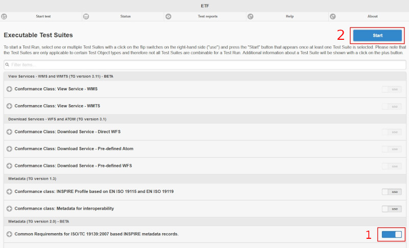
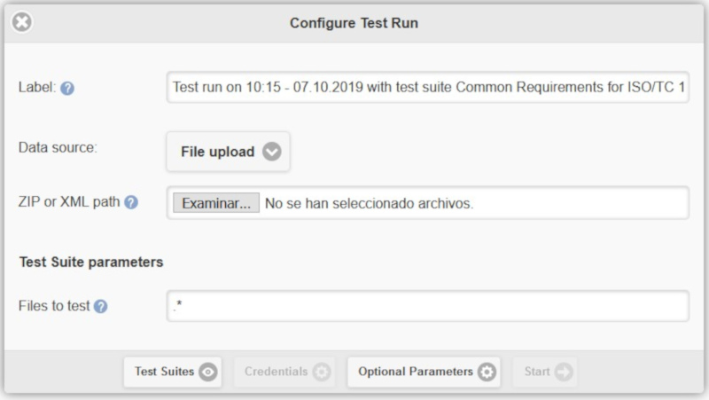
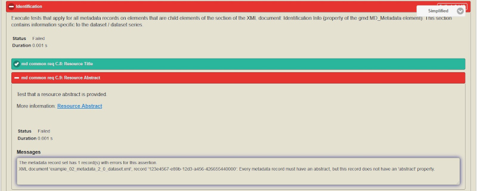
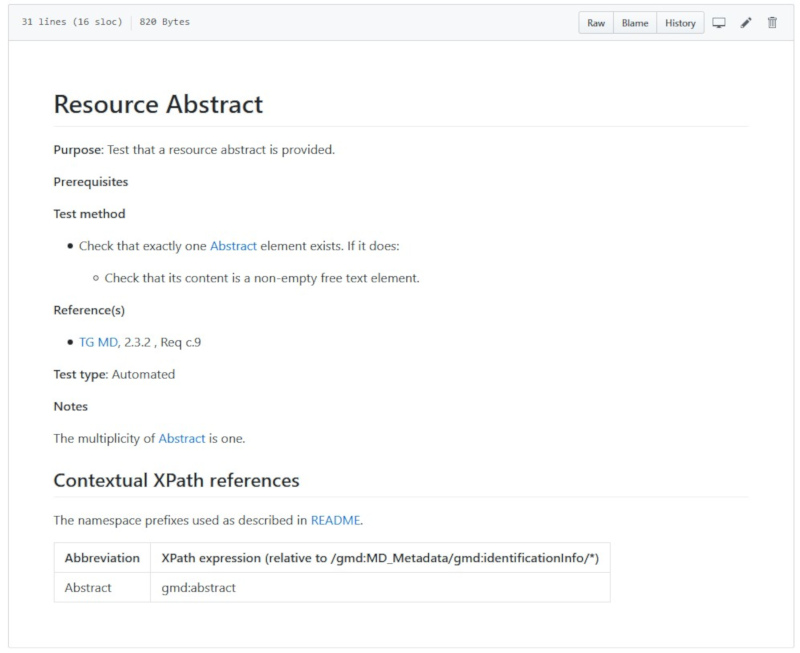
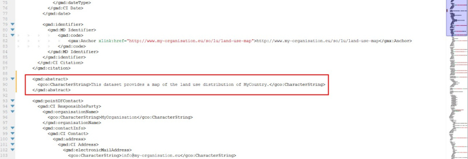
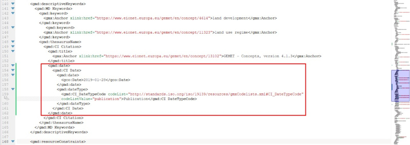
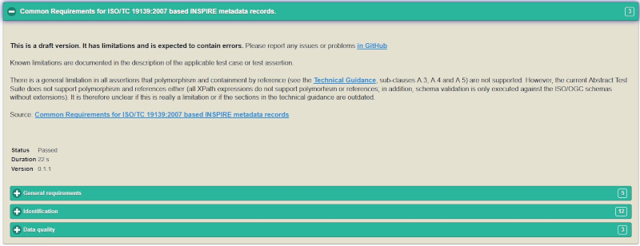

# Step-by-step exercise on validation using the webapp

*Workshop on the INSPIRE Reference Validator - October 1-2, 2019, Ispra, Italy*

## Introduction
This exercise is an example of the procedure to follow in order to make a metadata record valid against the "Common Requirements Conformance Class" from Technical Guidance 2.0.

It is an iterative procedure that starts by checking the conformity of the metadata, understanding the error messages, fix the problems found and iterating again until all the tests are passed.

## Download the metadata file
First, download the [metadata file](./metadata_example.xml) for this exercise to your file system.

## Check conformity
Open the [INSPIRE Reference Validator](http://inspire.ec.europa.eu/validator/) web application.

Search for the Conformance Class that we want the metadata to validate against. In this case, under `Metadata (TG version 2.0)`, locate the Conformance Class `Common Requirements for ISO/TC 19139:2007 based INSPIRE metadata records`. Click the **`use`** button and then **`Start`**.

In the new dialogue, upload the metadata file downloaded previously and click the **`Start`** button. The label might be modified in order to help you identifying the Test Report once the test will be executed.

The test will run according with the Conformance Class choosen and the metadata file uploaded. When finished, the corresponding Test Report is displayed.

The failed tests are: `C.1`, `C.9`, `C.15`, `C.17` and `C.21`.

We recommend to fix the problems one by one. Then, every time the metadata file is modified to fix a problem, it has to be validated again to ensure the problem is fixed.

## Understand error messages

In order to make the metadata file conformant, we have to go over the failed tests one by one, understand what is the problem about and fix it afterwards.

The test that failed can be expanded to get a descriptive message. For instance, under `C.9: Resource Abstract`, a message is shown with the following content: _Every metadata record must have an abstract, but this record does not have an 'abstract' property_.

If more information is required, the corresponding Abstract Test Case can be easily accessed from the link `Resource Abstract` in blue color from the previous image. In the Abstract Test Case, the Test Steps are described and the XPath to the element is shown.

Now, we open the XML metadata file with a text editor. We can see that the abstract element is missing.

## Fix the problem

To fix the `C.9: Resource Abstract` failed test, we will add the missing element in the XPath described in the Abstract Test Case. To do so, we open the XML metadata file with a text editor and add the following element in line 89.

## Check conformity again

Then, we can validate again the metadata file to check that the problem has been fixed. We proceed as described above and the following result is obtained.

We can see that the `C.9: Resource Abstract` test is now passed.

## Iterative process

We will proceed iteratively as described in the previous sections _Check conformity_, _Understand error messages_ and _Fix the problem_ until all the the tests pass.

To pass test C.15 we add the date element as shown in the following image.

Then, to pass test C.17 we have to specify the Article of the INSPIRE Directive.

Finally, to pass test C.21 we include the date that was missing.

## Exercise solution

Once all the problems are fixed and the metadata file is conformant, the Test Report will display all the tests in green color.

The metadata file with all the errors already fixed can be found [here](./solution_metadata_example.xml).
